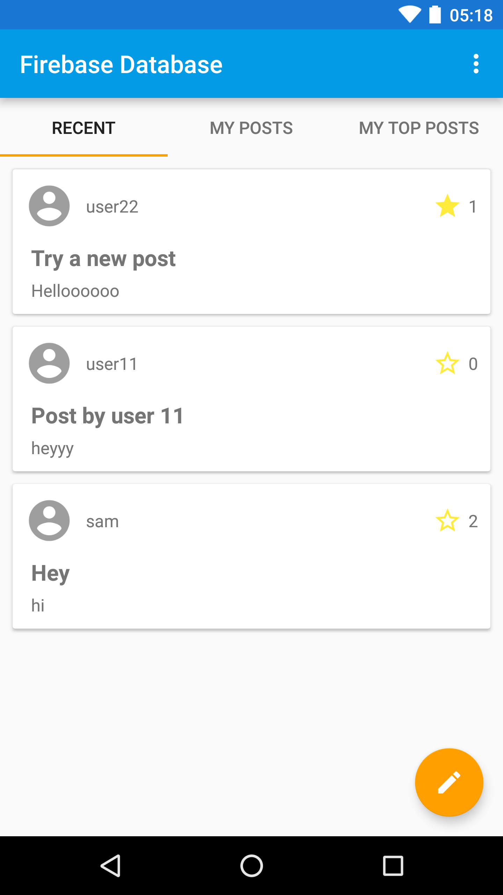

Service-Hub
=============================
So far----

- [Authentication using firebase Database]
- [Get Location based Service Provider ]
- [Auto Suggested search Bar and implemented]
- [Get service Provider list from firebase real time database]

Result
-----------

Data Model
-----------
We used Firebase Database. 

The database has two "root" nodes:

  * `users` - a list of `User` objects, keyed by user ID. So
    `/users/<ID>/email` is the email address of the user with id=`<ID>`.
  *`Profile`-keyed by user ID which contains location,skills,rating(if service Provider).

  Libaray used:
  
  1.android.support:recyclerview
  2.android.support:cardview
  3.android.support:design
  4.firebaseui:firebase-ui-database
  5.google.firebase:firebase-auth
  6.google.firebase:firebase-auth
  7.github.florent37:materialtextfield
  8.balysv:material-ripple
  9.github.rey5137:material
  10.jakewharton:butterknife
  11.com.weiwangcn.betterspinner:library-material
  12..cachapa.expandablelayout:expandablelayout
  
  
  
  =====================will be updated with more feature,very soon========================